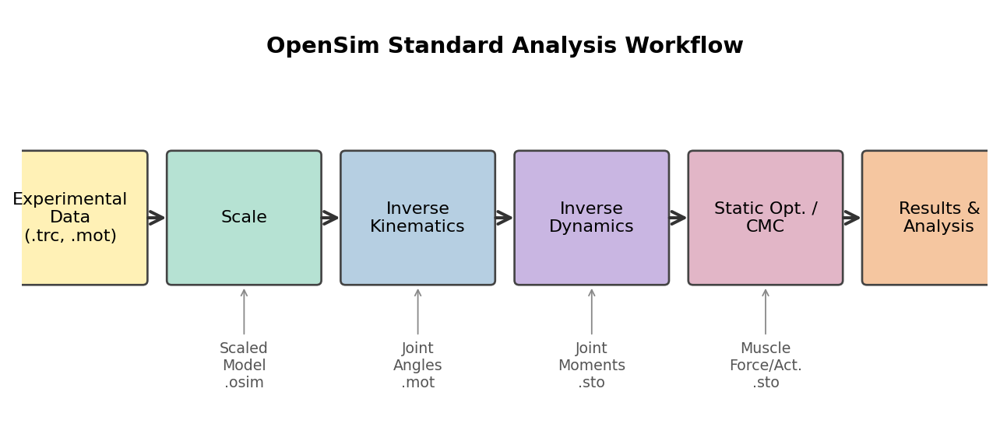
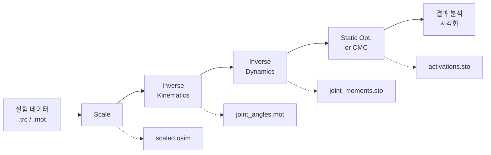
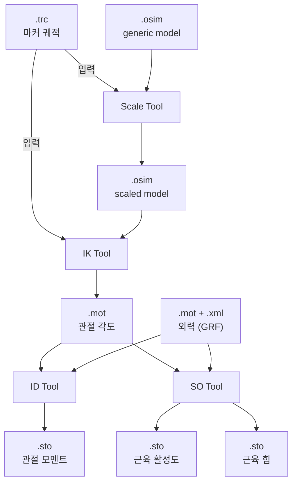

# 1장. OpenSim 소개

## 1.1 OpenSim이란?

**OpenSim**은 스탠퍼드 대학교 NCSRR과 NIH 지원 Mobilize/Restore Centers에서 개발·유지하는
오픈소스 근골격계 모델링 및 동역학 시뮬레이션 소프트웨어이다. 사용자는 다음을 수행할 수 있다.

- 인체 또는 동물의 **근골격계 모델(musculoskeletal model)** 구축·수정
- 실험에서 얻은 **모션 캡처 데이터**로부터 **관절 각도, 관절 모멘트, 근육 활성도, 근육력** 추정
- **순동역학(forward dynamics)** 시뮬레이션을 통한 가상 실험
- **최적제어(optimal control)** 기반 운동 예측 (Moco)
- 결과의 시각화·분석 및 그래프 출력

GUI 외에도 **Python**, **MATLAB**, **C++** 인터페이스를 제공하여 반복 실험과 자동화가 가능하다.

## 1.2 적용 분야

| 분야 | 활용 예시 |
| ---- | --------- |
| 보행 분석 (Gait Analysis) | 정상·병적 보행의 관절 각도/근력 비교 |
| 재활 공학 | 의지(prosthesis), 보조기(orthosis) 설계 검증 |
| 스포츠 과학 | 점프·스윙·달리기 동작의 근활성 분석 |
| 수술 계획 | 건 이전(tendon transfer) 술식의 효과 예측 |
| 인체공학 | 작업장 자세에 따른 근부하 평가 |
| 뇌·신경 공학 | 운동제어 모델, 신경 자극 효과 시뮬레이션 |

## 1.3 핵심 개념

연구를 시작하기 전 다음 용어를 숙지하는 것이 좋다.

### 1.3.1 모델 구성요소

- **Body** — 강체(rigid body). 골격을 구성한다.
- **Joint** — 두 Body 사이의 구속. PinJoint, BallJoint, CustomJoint 등이 있다.
- **Coordinate** — 관절의 자유도(DOF). 각도 또는 변위.
- **Muscle / Actuator** — 힘을 발생시키는 요소. Hill 모델 기반 근육이 표준이다.
- **Marker** — 모션 캡처 마커가 부착되는 해부학적 위치.
- **Constraint / Contact Geometry** — 운동 구속, 접촉 모델링.

### 1.3.2 주요 분석 단계

*그림 1-1. OpenSim 표준 분석 워크플로 — 각 단계의 출력이 다음 단계의 입력이 된다.*

### 1.3.3 주요 파일 포맷

| 확장자 | 설명 |
| ------ | ---- |
| `.osim` | OpenSim 모델 정의 (XML 기반) |
| `.trc`  | 모션 캡처 마커 궤적 |
| `.mot`  | 모션(관절각/외력) 시계열 |
| `.sto`  | Storage 파일 — 일반 시계열 데이터 |
| `.xml`  | 도구별 설정 파일 (Scale, IK, ID 등) |
| `.c3d`  | 3D 모션 캡처 표준 포맷 (OpenSim에서 읽기 가능) |

파일 포맷의 입출력 관계는 다음과 같다.

## 1.4 OpenSim 4.x의 특징

- **Component 기반 아키텍처** — 모든 모델 요소가 `Component`로 통일되어 확장이 쉽다.
- **Moco(Multibody Optimal Control)** — 예측 시뮬레이션을 위한 최적제어 프레임워크 내장.
- **Python/MATLAB 바인딩 강화** — `conda install -c opensim-org opensim`으로 설치 가능.
- **Cross-platform GUI** — Windows, macOS, Linux 모두에서 동일한 인터페이스 제공.

## 1.5 다음 장 안내

다음 장에서는 [운영체제별 설치 방법](02-설치.md)을 다룬다.
