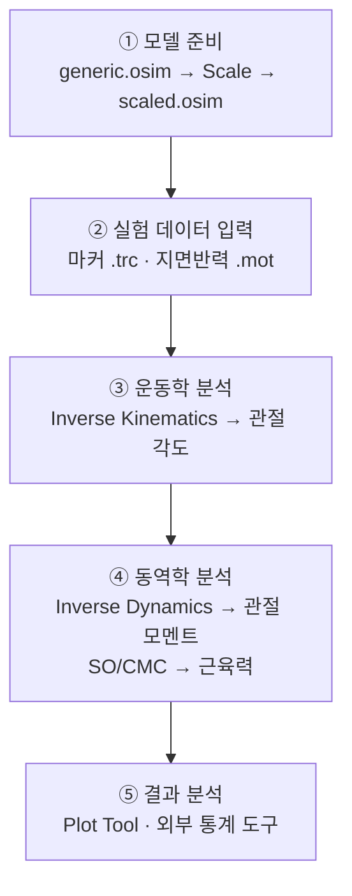

# 3장. 시작하기

본 장에서는 OpenSim GUI를 처음 실행하여 **예제 모델을 불러오고**,
**관절을 움직여 보고**, **간단한 시뮬레이션을 실행**하는 과정을 안내한다.

## 3.1 첫 실행

설치 후 OpenSim GUI를 실행하면 다음과 같은 메인 창이 나타난다.

```
┌─────────────────────────────────────────────────────────────┐
│ File  Edit  View  Tools  Window  Help                       │ ← 메뉴바
├─────────────────────────────────────────────────────────────┤
│ [▶ ◼ ⟲]  [Scale][IK][ID][SO][CMC][FD]  [Plot]              │ ← 툴바
├──────────────┬───────────────────────────┬──────────────────┤
│              │                           │                  │
│  Navigator   │      3D Visualizer        │   Coordinates    │
│              │                           │                  │
│              │                           │                  │
├──────────────┴───────────────────────────┴──────────────────┤
│                       Messages                              │
└─────────────────────────────────────────────────────────────┘
```

처음에는 모델이 없는 빈 상태이며, 우측 하단의 **Messages** 패널에 OpenSim 버전과 라이브러리
로딩 메시지가 표시된다.

## 3.2 예제 모델 열기

### 3.2.1 메뉴로 열기

1. 상단 메뉴에서 **File → Open Model...** 선택.
2. 설치 폴더의 `Models/Arm26/arm26.osim` 파일을 선택한다.
   - Windows: `C:\OpenSim 4.5\Models\Arm26\arm26.osim`
   - macOS: `/Applications/OpenSim 4.5/Models/Arm26/arm26.osim`
3. 3D 뷰어에 어깨–팔꿈치 2자유도, 6개 근육의 팔 모델이 표시된다.

### 3.2.2 단축키 / 드래그앤드롭

- `Ctrl+O` (macOS: `⌘+O`) — Open Model
- 탐색기에서 `.osim` 파일을 GUI 창으로 드래그하여 열 수도 있다.

### 3.2.3 추천 예제 모델

| 모델 | 설명 | 적합한 학습 주제 |
| ---- | ---- | ---------------- |
| Arm26 | 상완 2DOF, 근육 6개 | 근육-건 동역학 입문 |
| Gait2354 | 보행용 23자유도 모델 | IK / ID / Scale |
| Leg6Dof9Musc | 한쪽 다리 6DOF, 9근육 | Static Optimization |
| Rajagopal2015 | 풀바디 22DOF, 80개 이상 근육 | 본격 보행 분석 |

## 3.3 모델 둘러보기

### 3.3.1 3D 뷰어 조작

| 마우스 조작 | 동작 |
| ----------- | ---- |
| 좌클릭 + 드래그 | 회전 (orbit) |
| 우클릭 + 드래그 | 줌(상하) |
| 휠 | 줌 인/아웃 |
| 휠 클릭 + 드래그 | 패닝(이동) |
| `R` 키 | 카메라 리셋 |

### 3.3.2 좌측 Navigator

좌측 **Navigator** 패널에는 현재 열린 모델의 트리 구조가 표시된다.

```
arm26.osim
├── Bodies
│   ├── humerus
│   ├── ulna_radius_hand
│   └── ground
├── Joints
│   ├── r_shoulder
│   └── r_elbow
├── Forces
│   ├── BIClong
│   ├── BICshort
│   ├── BRA
│   └── ...
├── Markers
└── Controllers
```

각 항목을 더블클릭하면 우측 **Properties** 창에서 속성을 확인·편집할 수 있다.

### 3.3.3 Coordinates 패널

우측 **Coordinates** 패널에는 모델의 각 자유도가 슬라이더로 표시된다.
슬라이더를 움직이면 3D 뷰어에서 모델이 즉시 따라 움직이며, 이를 **Pose 편집** 이라 한다.

- `r_shoulder_elev` 슬라이더를 움직이면 어깨가 굴곡/신전된다.
- `Lock` 버튼으로 특정 자유도를 고정할 수 있다 (IK 시 유용).
- `Reset` 버튼은 기본 자세(default pose)로 되돌린다.

## 3.4 표준 워크플로 개관

연구에서 사용하는 일반적인 분석 흐름은 다음과 같다.



각 단계의 상세 사용법은 [6장 주요 분석 도구](06-주요-도구.md)에서 다룬다.

## 3.5 첫 시뮬레이션 실행 (Forward Dynamics 데모)

Arm26 모델로 매우 간단한 순동역학 시뮬레이션을 수행해 본다.

1. Arm26 모델이 열려 있는지 확인한다.
2. 메뉴 **Tools → Forward Dynamics...** 선택.
3. 다이얼로그에서 다음을 설정.
   - **Time range**: `0 ~ 1.0` 초
   - **Controls file**: 비워둠 (모든 근육 활성도 = 0 기본값)
   - **Output directory**: 작업용 폴더 지정
4. **Run** 버튼 클릭. 진행 상황이 Messages 창에 표시된다.
5. 완료되면 **File → Load Motion...** 으로 결과 `.mot` 파일을 불러와 애니메이션을 재생.

> 기본 컨트롤로는 큰 변화가 없을 수 있다. 시각적 변화를 보려면 BIClong 등에 일정한 활성도를
> 주는 컨트롤 파일(`.sto`)을 작성하여 입력한다.

## 3.6 작업 결과 저장

- **Save Model**: `File → Save Model As...` (`.osim`)
- **Save Motion**: 모션이 로드된 상태에서 `File → Save Motion As...` (`.mot` / `.sto`)
- **Save Setup**: 각 Tool 다이얼로그의 *Save Settings...* 버튼으로 `.xml` 설정 저장 → 재현성 확보

## 3.7 다음 장 안내

다음 장은 [GUI의 각 구성요소](04-GUI-개요.md)를 더 자세히 살펴본다.
