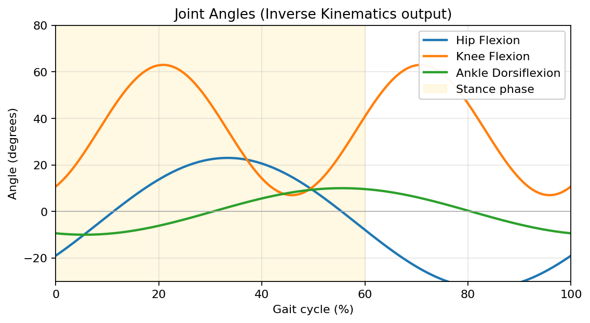
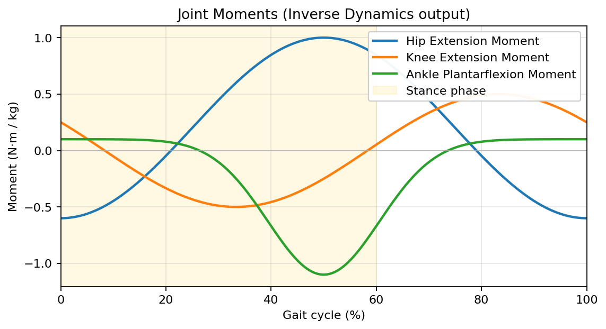
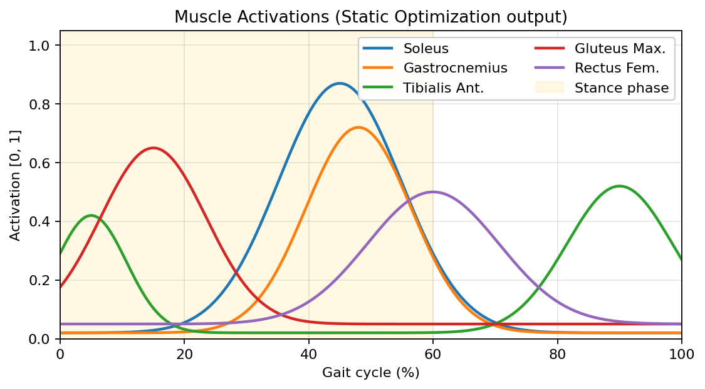

# 7장. 시각화와 결과 분석

본 장은 OpenSim GUI에서 결과를 **재생·그래프화·내보내기** 하는 방법을 설명한다.

## 7.1 모션 재생 (Motion Playback)

### 7.1.1 모션 로드

- `File → Load Motion...` 으로 `.mot` 또는 `.sto` 파일 로드.
- IK·CMC·FD 결과 모두 같은 방식.
- 여러 모션을 한 모델에 로드 가능 → Navigator > Motions 폴더에 누적.

### 7.1.2 재생 컨트롤

상단 툴바의 재생 컨트롤 사용:

| 버튼 | 동작 |
| ---- | ---- |
| ▶ | 재생 |
| ◼ | 정지 |
| ⟲ | 반복 |
| ◀◀ / ▶▶ | 처음/끝 |
| 슬라이더 | 재생 속도 (0.1× ~ 5×) |

### 7.1.3 동기 재생

같은 모델에 여러 모션이 로드된 경우, **Active Motion** (Navigator에서 굵게 표시) 만 재생된다.
모션 우클릭 → *Set Active* 로 전환.

### 7.1.4 마커·외력 함께 보기

- 모션 파일과 **같은 이름**의 마커 데이터(`.trc`) 또는 외력 데이터(`grf.mot`)가 있으면 동기화 재생.
- `File → Preview Experimental Data...` 메뉴로 별도 로드 가능.

## 7.2 Plot Tool — 그래프 출력

### 7.2.1 실행

`Tools → Plot...` 또는 툴바의 그래프 아이콘 클릭.

### 7.2.2 Y축 데이터 선택

1. **Add** 버튼.
2. **Source**: `.mot` / `.sto` 파일 선택 또는 *Loaded Motion* 선택.
3. **Y Quantity**: 컬럼 선택 (예: `hip_flexion_r`)
4. **Filter** — 저역통과 필터(Butterworth) 적용 가능.
5. **OK**.

### 7.2.3 X축 변경

기본은 시간(time). **Properties → X Axis**에서 다른 변수(예: gait cycle %)로 변경 가능.

### 7.2.4 옵션

- **Multiple curves**: 같은 그래프에 여러 곡선 추가 (예: 좌우 hip flexion 비교).
- **Legend, Axis labels, Title** 편집.
- **Color / Line style**: 곡선별 우클릭 → *Curve Properties*.

### 7.2.5 내보내기

- **File → Export Graph**: PNG, JPG, EPS, PDF 등.
- **File → Export Data**: 그래프 데이터를 `.sto`로 내보내기 → 외부 통계 도구(R, MATLAB)에서 분석.

### 7.2.6 대표적 결과 그래프 예시

연구에서 자주 그리는 세 종류의 그래프를 보자. 모두 보행 한 사이클(0~100 %, 0~60 %가
입각기) 기준이다.

#### IK 출력 — 관절 각도



*그림 7-1. IK 출력 — 입각기에서 고관절은 굴곡→신전, 슬관절은 first peak/second peak,
족관절은 plantarflexion 후 dorsiflexion으로 이어진다. 비정상 보행에서는 이 곡선의
시점과 진폭이 달라진다.*

#### ID 출력 — 관절 모멘트



*그림 7-2. ID 출력 — 체중으로 정규화한 관절 순모멘트(N·m/kg). 입각 후반의 큰
족저굴곡 모멘트가 추진력의 주된 원천이다.*

#### SO 출력 — 근육 활성도



*그림 7-3. SO 출력 — 보행 사이클별 주요 하지 근육의 활성도. 임상 EMG의 활성 시점·
패턴과 정성적으로 비교하여 결과 타당성을 점검한다.*

> 위 그래프들은 본 설명서용 예시 데이터이며, 실제 측정·시뮬레이션 결과를 대체하지 않는다.

## 7.3 3D 화면 캡처와 동영상

### 7.3.1 정지 이미지

- `View → Take Snapshot` (PNG 저장)
- `View → Print` (벡터 인쇄)

### 7.3.2 동영상 녹화

OpenSim GUI 내장 녹화 기능은 없으나, OS의 화면 녹화 도구 사용:

- **Windows**: Xbox Game Bar (`Win+G`)
- **macOS**: QuickTime Player → New Screen Recording
- **Linux**: OBS Studio, SimpleScreenRecorder

배경을 흰색/검정으로 변경(`View → Background Color`)하면 출판 자료에 적합하다.

## 7.4 결과 파일 직접 살펴보기

`.sto` / `.mot` 파일은 **ASCII 텍스트**이므로 일반 편집기로 열 수 있다.

```
Coordinates
version=1
nRows=101
nColumns=24
inDegrees=yes
endheader
time	pelvis_tilt	pelvis_list	pelvis_rotation	...
0.000	-9.821	-2.105	-3.114	...
0.010	-9.831	-2.090	-3.110	...
...
```

- **header**: 메타데이터 (`inDegrees`, `nRows`, `nColumns`)
- **데이터**: 탭 구분, 첫 컬럼은 시간.

### 외부에서 읽기

Python으로 빠르게 읽기:

```python
import pandas as pd
import numpy as np

def read_sto(path):
    with open(path) as f:
        lines = f.readlines()
    header_end = next(i for i, l in enumerate(lines) if l.strip() == "endheader")
    return pd.read_csv(path, sep="\t", skiprows=header_end + 1)

df = read_sto("results/inverse_kinematics.mot")
print(df.columns)
df.plot(x="time", y="hip_flexion_r")
```

OpenSim Python API로 직접 읽기:

```python
import opensim as osim
table = osim.TimeSeriesTable("results/inverse_kinematics.mot")
print(table.getColumnLabels())
```

## 7.5 결과 진단 체크리스트

| 단계 | 점검 항목 | 기준 |
| ---- | --------- | ---- |
| Scale | Marker error | RMS < 1 cm |
| IK | Marker error (RMS/max) | RMS < 2 cm, max < 4 cm |
| ID | Residual force/moment | 보행 시 잔차 < 체중의 5% |
| SO | Reserve actuator 사용량 | 모멘트의 < 10% |
| CMC | Tracking error (관절각) | < 1° |
| FD/Moco | 적분 안정성, 컨트롤 부드러움 | 수렴 메시지 확인 |

> 잔차(residual)가 큰 경우 **RRA(Residual Reduction Algorithm)** 도구로 모델·운동학을 보정한다.

## 7.6 다음 장 안내

마지막 장은 [문제 해결과 추가 학습 자료](08-문제해결-참고자료.md)를 정리한다.
