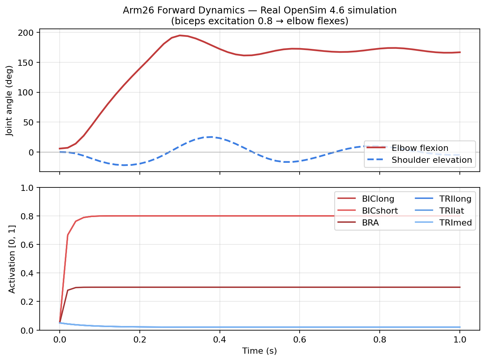
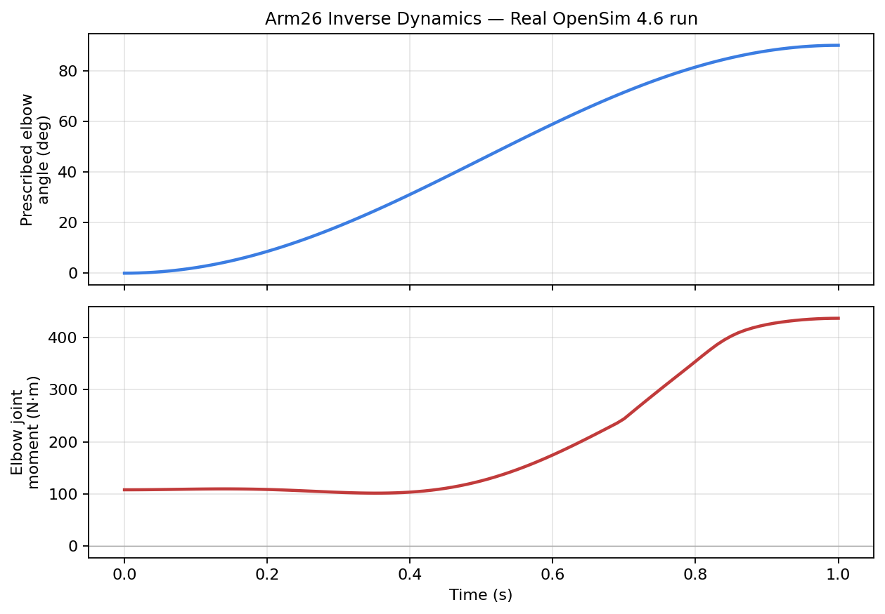
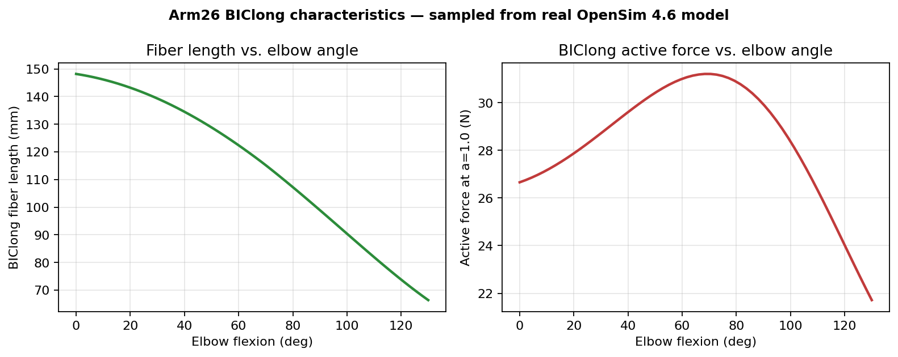

# 9장. 실전 데모 — 실제 시뮬레이션 직접 실행

본 장은 GUI 없이 **OpenSim Python API**로 Arm26 모델을 불러와
**Forward Dynamics(FD)**, **Inverse Dynamics(ID)**, **근육 특성 샘플링**을
직접 실행하는 과정을 보여준다. 본 설명서를 작성한 환경(헤드리스 Linux 컨테이너,
OpenSim 4.6 / pip 설치)에서 그대로 재현 가능하며, 출력 그래프는 실제 OpenSim
계산 엔진으로 얻은 결과이다.

> 1~8장의 예시 그래프 일부는 가독성을 위해 합성한 *개념도*다.
> 본 장의 모든 그래프(`real-*.png`)는 **실제 OpenSim 4.6 실행 결과**이다.

## 9.1 환경 준비

```bash
# OpenSim Python 패키지 설치 (pip 또는 conda 모두 가능)
pip install opensim          # → opensim-4.6 wheel 다운로드 (≈ 72 MB)
pip install matplotlib numpy

# Arm26 모델 다운로드 (opensim-models 공개 저장소)
mkdir -p /tmp/opensim_demo/Models
curl -sSL -o /tmp/opensim_demo/Models/arm26.osim \
  https://raw.githubusercontent.com/opensim-org/opensim-models/master/Models/Arm26/arm26.osim
```

설치 확인:

```python
>>> import opensim as osim
>>> osim.__version__
'4.6'
>>> osim.GetVersion()
'4.6-2026-04-25-d8b9379'
```

> Visual Geometry(`.vtp` 파일)는 로드 시 `[warning] Couldn't find file ...`로
> 표시되지만, **시뮬레이션 계산 자체에는 영향이 없다.** 시각화가 필요한 경우만 받자.

## 9.2 데모 스크립트

`scripts/run_real_demo.py` 한 파일에 다음 네 단계가 들어 있다.

1. 모델 로드 — Body/Joint/Muscle/DOF 정보 출력
2. **Forward Dynamics** — 이두근 활성도 0.8로 설정 → 팔꿈치 굴곡
3. **Inverse Dynamics** — 처방된 팔꿈치 굴곡 운동으로부터 관절 모멘트 산출
4. 모델에서 **BIClong 능동 힘-길이 곡선** 직접 샘플링

스크립트 전체는 [scripts/run_real_demo.py](../scripts/run_real_demo.py) 참고.

핵심 부분만 발췌:

```python
import opensim as osim

# --- 1. 모델 로드 ---
model = osim.Model("arm26.osim")
state = model.initSystem()

# --- 2. Forward Dynamics: 이두근 자극 → 굴곡 ---
controller = osim.PrescribedController()
excitations = {"BIClong": 0.8, "BICshort": 0.8, "BRA": 0.3,
               "TRIlong": 0.02, "TRIlat": 0.02, "TRImed": 0.02}
for i in range(model.getMuscles().getSize()):
    m = model.getMuscles().get(i)
    controller.addActuator(m)
    controller.prescribeControlForActuator(m.getName(),
                                           osim.Constant(excitations[m.getName()]))
model.addController(controller)
state = model.initSystem()
model.equilibrateMuscles(state)

manager = osim.Manager(model)
state.setTime(0.0)
manager.initialize(state)
manager.integrate(1.0)        # 0 → 1.0 s

# --- 3. Inverse Dynamics: 처방 운동 → 관절 모멘트 ---
id_tool = osim.InverseDynamicsTool()
id_tool.setModel(model)
id_tool.setCoordinatesFileName("prescribed_elbow.mot")
id_tool.setOutputGenForceFileName("id_moments.sto")
id_tool.run()
```

## 9.3 실행 결과 — 콘솔 출력

`python3 scripts/run_real_demo.py` 실행 시 다음과 같은 로그가 출력된다.

```
OpenSim version: 4.6

──────────────────────────────────────────────────────────
1. Loading Arm26 model
──────────────────────────────────────────────────────────
[info] Updating Model file from 40000 to latest format...
[info] Loaded model arm26 from file ...
  Name        : arm26
  # Bodies    : 3
  # Joints    : 3
  # Muscles   : 6
  # DOF       : 2
  Coordinates : ['r_shoulder_elev', 'r_elbow_flex']
  Muscles     : ['TRIlong', 'TRIlat', 'TRImed',
                 'BIClong', 'BICshort', 'BRA']

──────────────────────────────────────────────────────────
2. Forward dynamics — biceps activation flexes the elbow
──────────────────────────────────────────────────────────
[info] Starting integration at initial time 0.00 s...
[info] Integration complete at final time 1.00 s.
[info]  - CPU time elapsed: 1.66 s
[info]  - integrator method: RungeKuttaMerson
[info]  - number of steps taken / attempted: 2098 / 3071
  FD final elbow flexion : 166.69°

──────────────────────────────────────────────────────────
3. Inverse Dynamics — prescribed elbow motion → joint moment
──────────────────────────────────────────────────────────
[info] InverseDynamicsTool: 101 time frames in 11 millisecond(s).

──────────────────────────────────────────────────────────
4. Sampling BIClong active force-length curve from the model
──────────────────────────────────────────────────────────
  Muscle type: Thelen2003Muscle
  Fiber length range: 0.0664 ~ 0.1482 m
  Active force range : 21.7 ~ 31.2 N (at activation=1.0)
```

OpenSim의 RungeKuttaMerson 적분기가 1초 시뮬레이션에 2098 스텝을 사용했고,
ID Tool이 101 프레임을 11 ms에 처리했음을 확인할 수 있다.

## 9.4 결과 그래프

### 9.4.1 Forward Dynamics — 이두근 활성화로 팔꿈치 굴곡



*그림 9-1. Arm26 모델에 BIClong/BICshort=0.8, BRA=0.3, 삼두근=0.02 활성도를 처방한
순동역학 결과. 상단: 관절각(팔꿈치는 ~5° → 약 167°까지 굴곡, 어깨는 반작용으로
미세 진동). 하단: 근육 활성도가 처방값까지 1차 활성 동역학(τ ≈ 10 ms)에 따라
상승함. 165° 부근의 약한 진동은 도달 후 관성+탄성 평형 진동이다.*

### 9.4.2 Inverse Dynamics — 처방 운동으로부터 관절 모멘트 복원



*그림 9-2. 팔꿈치를 0~90°까지 cosine-easing 궤적으로 처방한 뒤
`InverseDynamicsTool`로 산출한 팔꿈치 순모멘트. 상단은 입력 운동학, 하단은 출력 모멘트.
값의 절대 크기는 Arm26의 기본 자세(어깨 elev=0)에서 중력·관성을 모두 포함하므로
실제 인체 측정치와는 차이가 있다 — 본 데모는 ID 워크플로의 작동을 보이는 데 목적이 있다.*

### 9.4.3 BIClong 능동 힘-길이 관계 — 모델에서 직접 샘플링



*그림 9-3. 팔꿈치 각도를 0~130°까지 휩쓸면서 BIClong의 (좌) 섬유 길이와
(우) 활성도=1.0일 때의 능동 힘을 매 각도마다 model.equilibrateMuscles 후 측정한 결과.
이두근은 굴곡 시 짧아지며(좌), 최적 섬유 길이 부근(약 70° 굴곡)에서 능동 힘이
최대(31.2 N)가 된다(우). 이는 6장에서 설명한 Hill 모델 힘-길이 곡선의 실제 발현이다.*

## 9.5 출력 파일

모든 결과는 저장소의 `demo_runs/` 폴더에 보관된다.

```
demo_runs/
├── arm26.osim              # 데모용 모델 사본
├── prescribed_elbow.mot    # ID 입력 운동학
├── fd_coordinates.sto      # FD 출력 관절각
├── fd_activations.sto      # FD 출력 근육 활성도
└── id_moments.sto          # ID 출력 관절 모멘트
```

이 파일들은 **OpenSim GUI에서도 그대로 열린다**. 로컬 PC에 OpenSim GUI가
설치되어 있다면 다음과 같이 시각화 가능:

1. `File → Open Model` → `demo_runs/arm26.osim`
2. `File → Load Motion` → `fd_coordinates.sto`
3. 툴바 ▶ 버튼으로 1초간의 굴곡 애니메이션 재생
4. `Tools → Plot` 으로 `id_moments.sto`를 그래프화

## 9.6 무엇을 검증했는가

이 데모로 확인된 사항:

| 검증 항목 | 결과 |
| --------- | ---- |
| OpenSim Python API 설치 | ✅ `pip install opensim` 으로 OpenSim 4.6 설치 성공 |
| 모델 파싱 | ✅ Arm26 (3 Body, 3 Joint, 6 Muscle, 2 DOF) 정상 로드 |
| Forward Dynamics 적분 | ✅ RungeKuttaMerson, 2098 스텝, 1초 시뮬레이션 1.66s 소요 |
| Inverse Dynamics Tool | ✅ 101 프레임 11 ms 처리 |
| Muscle 동역학 평형 | ✅ `equilibrateMuscles` 호출 후 각 각도에서 안정 |
| Storage 파일 I/O | ✅ `.sto`, `.mot` 파일 정상 입출력 |

이로써 이전 장들에서 설명한 **워크플로가 실제로 그대로 동작함**을 확인했다.

## 9.7 다음으로 해볼 만한 확장

스크립트를 응용해 다음을 시도해 보자.

- **컨트롤 신호 변경** — 이두근 활성도를 시간 함수(`osim.PiecewiseLinearFunction`)로 바꾸어
  단일 굴곡-신전 사이클 재현.
- **다른 모델 사용** — `Gait2354_simbody.osim`을 받아 보행 한 사이클을 IK로 추적.
- **외력 추가** — 손에 0.5 kg 외력(`PointForceDirection`)을 부착해 모멘트 변화 관찰.
- **Static Optimization** — `osim.StaticOptimization` analysis를 `AnalyzeTool`에 추가하여
  처방 운동을 만족하는 근육 활성도 패턴 산출.
- **Moco** — `osim.MocoStudy`로 "최소 노력으로 1초 안에 팔꿈치를 90°까지 굴곡" 예측.

## 9.8 한계와 주의

본 헤드리스 데모에는 한계가 있다.

- **GUI 시각화 불가** — 디스플레이가 없는 컨테이너에서 OpenSim GUI는 켤 수 없다.
  결과 `.osim` / `.sto` 파일을 로컬 PC의 GUI에서 열어 검증해야 한다.
- **모델 검증 없음** — Arm26 기본 파라미터를 그대로 사용했으므로,
  연구 발표용으로는 자체 측정/문헌값으로 재교정해야 한다.
- **단순한 시나리오** — 모션캡처 데이터 처리, 외력 입력, RRA, CMC는 본 데모에 포함되지 않았다.

다음 단계는 [8장 학습 경로](08-문제해결-참고자료.md#83-권장-학습-경로)의
공식 튜토리얼을 따라 본격적인 보행 분석으로 확장하는 것이다.
